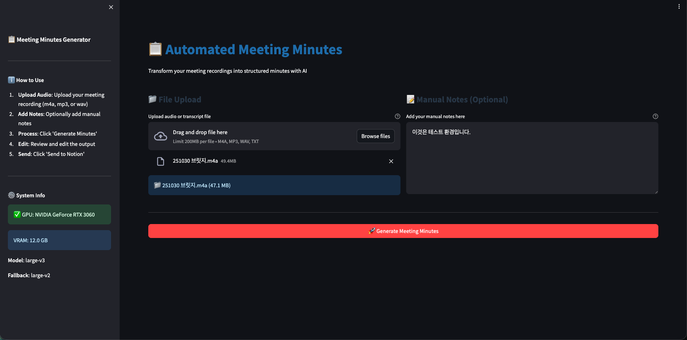
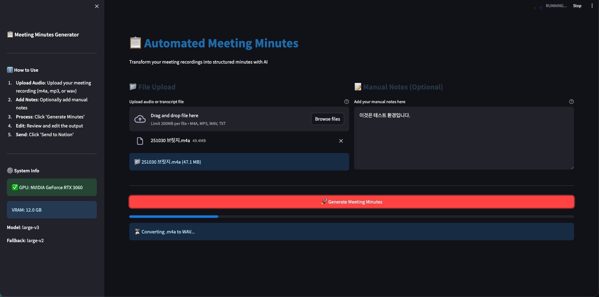
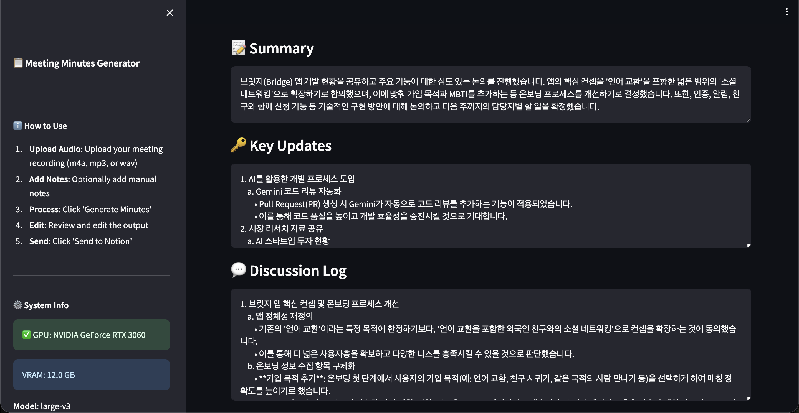
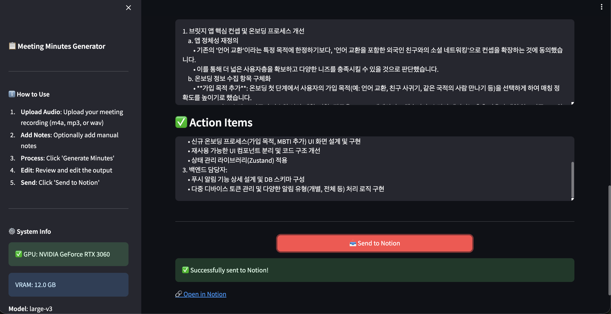
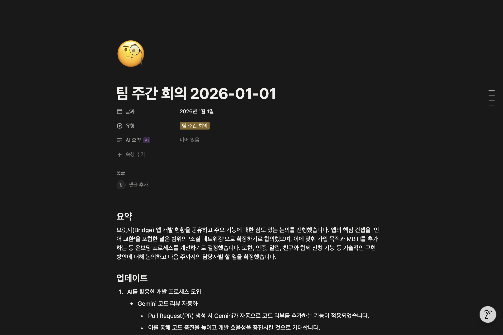

# 📋 Meeting Minutes Maker

> 회의 녹음 파일을 업로드하면 AI가 자동으로 회의록을 생성하고 Notion에 저장합니다.

[]()
[]()
[]()
[]()

**🎯 실제 업무에서 매주 사용 중인 자동화 도구입니다.**

| Before | After |
|--------|-------|
| 회의록 작성 2시간 | **10분으로 단축** |

---

## 📸 Demo

### 1. 오디오 파일 업로드

*회의 녹음 파일(m4a, mp3, wav)을 드래그 앤 드롭*

### 2. AI 처리 중

*Whisper가 음성을 텍스트로 변환 중*

### 3. 회의록 생성 결과

*Summary, Key Updates, Discussion Log 자동 생성*

### 4. 액션 아이템 & Notion 전송

*Action Items 생성 후 원클릭으로 Notion 전송*

### 5. Notion에 저장 완료

*구조화된 회의록이 Notion 페이지로 저장*

---

## ✨ 주요 기능

- **음성 → 텍스트**: Whisper large-v3로 고품질 한국어 음성 인식
- **스마트 요약**: Gemini Pro가 회의 내용을 4개 섹션으로 구조화
- **Notion 연동**: 원클릭으로 회의록 페이지 자동 생성
- **GPU 최적화**: RTX 3060 12GB VRAM 활용, OOM 자동 복구

---

## 🛠 기술 스택

| 영역 | 기술 |
|------|------|
| **Speech-to-Text** | OpenAI Whisper (large-v3) |
| **Voice Detection** | Silero VAD |
| **LLM** | Google Gemini Pro |
| **Frontend** | Streamlit |
| **Integration** | Notion API |
| **Infra** | CUDA 11.8, PyTorch |

---

## 🏗 Architecture

```
┌─────────────┐     ┌─────────────┐     ┌─────────────┐     ┌─────────────┐
│   Audio     │────▶│   Whisper   │────▶│   Gemini    │────▶│   Notion    │
│   Upload    │     │   + VAD     │     │   Pro       │     │   API       │
└─────────────┘     └─────────────┘     └─────────────┘     └─────────────┘
     .m4a            음성 → 텍스트         텍스트 → 회의록       자동 저장
```

**처리 흐름:**
1. 오디오 업로드 (m4a, mp3, wav)
2. Silero VAD로 무음 구간 제거
3. Whisper로 음성 인식 (GPU 가속)
4. Gemini Pro가 회의록 4개 섹션 생성
5. Notion 페이지로 자동 저장

---

## 🚀 Quick Start

### 요구사항
- Python 3.10+
- NVIDIA GPU (CUDA 11.8+)
- Gemini API Key
- Notion Integration Token

### 설치

```bash
git clone https://github.com/KIMGYUDONG/minutes-maker.git
cd minutes-maker/meeting_log
pip install -r requirements.txt
cp .env.example .env  # API 키 설정
streamlit run app.py
```

> 📖 상세 설치 가이드는 [SETUP.md](./meeting_log/README.md) 참조

---

## 📄 License

MIT License

---

## 📬 Contact

프로젝트에 대해 궁금한 점이 있으시면 연락주세요.

- **Email**: zlsrbrhd@gmail.com
- **GitHub**: [@KIMGYUDONG](https://github.com/KIMGYUDONG)
